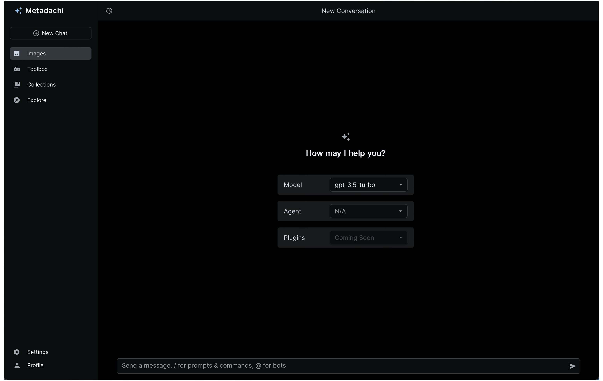
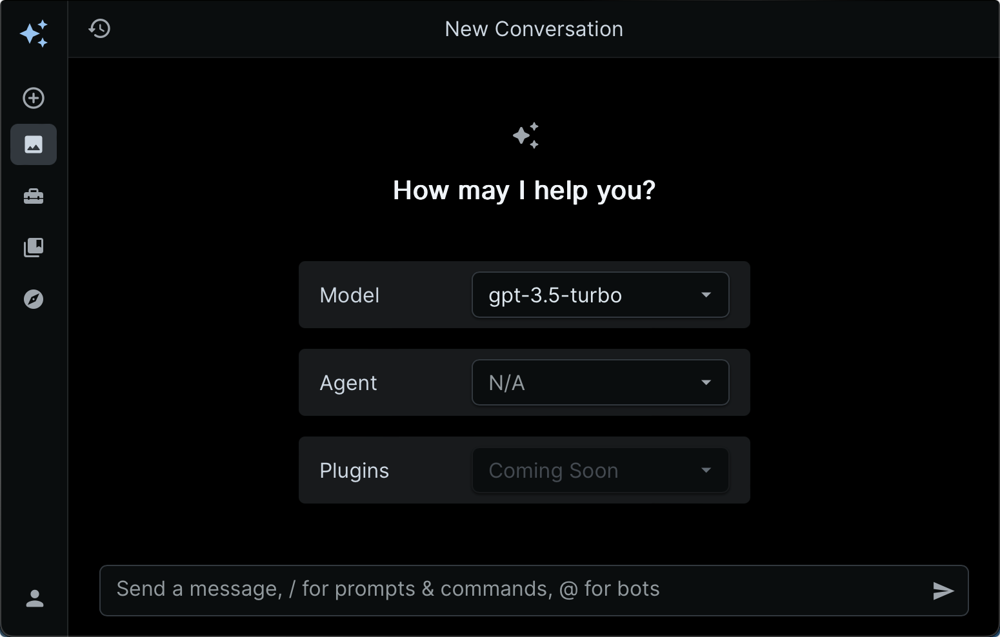

<div align="center">
<h1 align="center">Metadachi (In Progress)</h1>

[![Web][Web-image]][web-url]
[![Windows][Windows-image]][download-url]
[![MacOS][MacOS-image]][download-url]

[web-url]: https://app.metadachi.com
[download-url]: https://github.com/Phanturne/metadachi/releases
[Web-image]: https://img.shields.io/badge/Web-PWA-orange?logo=microsoftedge
[Windows-image]: https://img.shields.io/badge/-Windows-blue?logo=windows
[MacOS-image]: https://img.shields.io/badge/-MacOS-black?logo=apple
[Linux-image]: https://img.shields.io/badge/-Linux-333?logo=ubuntu

Boost your productivity with Metadachi, our cross-platform AI assistant available on desktop and web. With quick access to many AI tools, effortlessly navigate tasks and elevating your workflow. Our platform also fosters community collaboration by providing a space for developers to share AI prompts, templates, and generations.

> This project builds on the outstanding work by the author and contributors of [ChatGPT Next Web](https://github.com/ChatGPTNextWeb/).




</div>

## Getting Started
Join the community through our web app [here](https://metadachi.com) or download the latest desktop application from [releases](). Alternatively, deploy your own version by following the [deployment guide]().

## Features
- 🚀 **Powerful AI Agents**: Access powerful AI agents with advanced customization options
- 🤖 LLM Options: Choose from OpenAI and Gemini to power your AI agents.
- 🔒 **Privacy Guaranteed**: Take control of your data by storing it locally or in your private database
- 🌐 **Cross Platform Sync**: Back up and sync data across Windows, macOS, and the web
- 💻 **Desktop App**: Lightweight desktop assistant (~5MB) with global hotkeys system tray integration
- 🛠️ **Easy Self-Hosting**: Deploy effortlessly to Vercel

## Roadmap
### High Priority
- [ ] 🤝 **Community Collaboration**: Share and explore AI prompts, templates, and generations (Supabase required)
- [ ] Custom AI agents and prompts
- [ ] ✨ Slash and @ Commands
- [ ] 📤 Retrieval Augmented Generation (RAG)

### Nice to Haves
- [ ] ⚜️ UI Redesign
  - [ ] Layout Customization Options
- [ ] 🐶 Interactive Desktop Companion
- [ ] Access multiple AI agents from a single chat
- [ ] 🎨 Visual Alchemy (Image Generation)
- [ ] 🧰 AI Toolbox
- [ ] ⚙️ Backend Alternatives
- [ ] 📱 Mobile App (Android, iOS)

## Technology Stack
| Technology         | Description                                             |
|--------------------|---------------------------------------------------------|
| Next.js v14        | React framework for fast, dynamic web apps              |
| Tauri              | Framework for lightweight, cross-platform desktop apps  |
| Vercel             | Hosting platform for simplified deployment and scaling  |
| Vercel AI SDK      | Library for building conversational streaming UIs       |
| LangChain          | Framework for developing conversational AI agents       |
| Supabase           | Real-time databases and authentication                  |
| Zustand            | Lightweight state management for React                  |
| JoyUI              | UI component library for efficient React development    |


### AI Resources
* **Models**: OpenAI, Hugging Face, Fireworks AI
* **Prompts**: [Awesome ChatGPT Prompts](https://github.com/f/awesome-chatgpt-prompts)

## Getting Started
To start using Metadachi today, you can either access our [Web App](https://app.metadachi.com) or download the latest desktop app from [Releases](https://github.com/phanturne/metadachi/releases).

## Deploy Your Own (Outdated)
### Web App
1. Deploy to Vercel:
   [](https://vercel.com/new/clone?repository-url=https%3A%2F%2Fgithub.com%2Fphanturne%2Fmetadachi&project-name=metadachi&repository-name=metadachi&demo-title=Metadachi&demo-url=https%3A%2F%2Fapp.metadachi.com)
2. Create a new Supabase project and navigate to the SQL Editor. Run [init.sql](supabase/init.sql) to initialize the database.
3. Fill out the required environment variables.
4. Add the default bots from [bots.json](supabase/bots.json). (This step is necessary as the default fallback bot configuration is sourced from this file. It will become optional in the future.)
```shell
pnpm import-bots
```

### Desktop App
1. Follow the steps for deploying a Web App
2. Set the environment variable: `NEXT_PUBLIC_CHAT_ENDPOINT: your-vercel-deployment-url/api/chat`
3. From the terminal, run the following commands:
```shell
pnpm install
pnpm app:build
```
4. Install the generated build package to your device.

## Contributing
We're on the lookout for contributors to join us in bringing this project to life. Dive in, share your brilliant ideas, and let's build something amazing together!

### 🌟 How to Contribute:
1. Check out our [Contributing Guidelines]() to get started.
2. Browse our [Issues](https://github.com/phanturne/metadachi/issues) to find tasks that match your interests or skills.
3. Fork the repository and make your contribution.
4. Submit a Pull Request, and let's collaborate to make our project even better!

### 🤔 Got Ideas?
If you have new features or improvements in mind, feel free to open an issue or join the discussion on our [Discord Server]() to share your thoughts. We're all ears for fresh perspectives!

## Acknowledgments
Kudos to the creators of the following repositories for their valuable contributions to the open-source community:
- [ChatGPT Next Web](https://github.com/Yidadaa/ChatGPT-Next-Web): Metadachi builds on the outstanding work by the author and contributors of ChatGPT Next Web.
- [Tauri + Next.js Template](https://github.com/kvnxiao/tauri-nextjs-template): Integration of the Tauri API with Next.js relies on the code snippets from this template.

## License
This project is licensed under the [Apache License 2.0](LICENSE) - see the [LICENSE](LICENSE) file for details.

### Third-Party Licenses
The licenses for third-party repositories used in this project can be found in the [LICENSE](LICENSE) file.