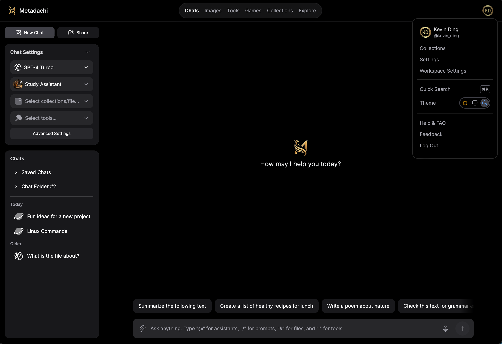
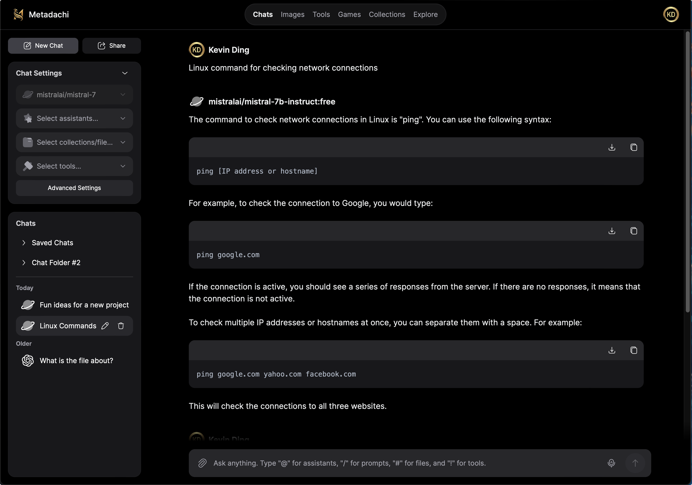
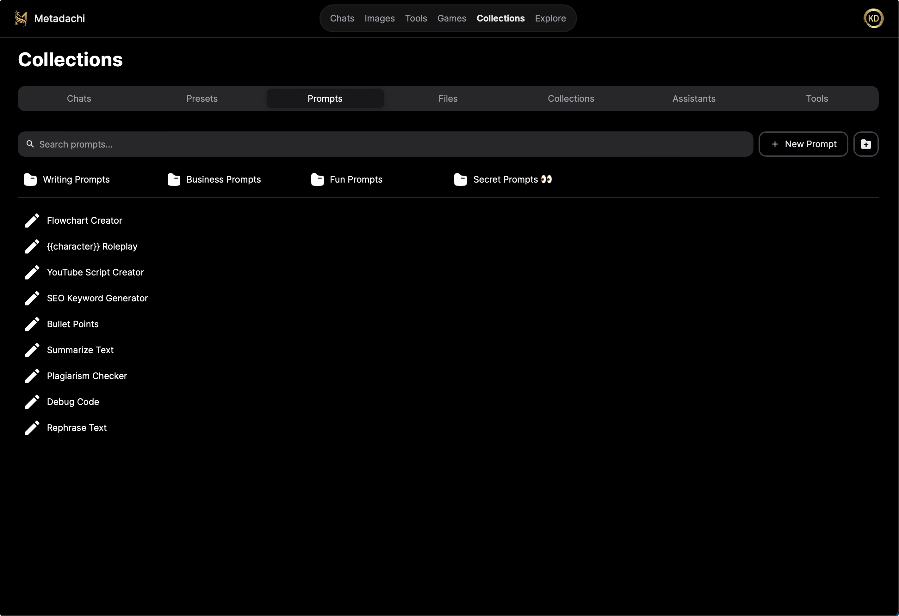

<div align="center">

<h1>Metadachi</h1>

[//]: # ([![Web][Web-image]][web-url])
[//]: # ([![Windows][Windows-image]][download-url])
[//]: # ([![MacOS][MacOS-image]][download-url])

[web-url]: https://app.metadachi.com
[download-url]: https://github.com/Phanturne/metadachi/releases
[Web-image]: https://img.shields.io/badge/Web-PWA-orange?logo=microsoftedge
[Windows-image]: https://img.shields.io/badge/-Windows-blue?logo=windows
[MacOS-image]: https://img.shields.io/badge/-MacOS-black?logo=apple
[Linux-image]: https://img.shields.io/badge/-Linux-333?logo=ubuntu

[](https://metadachi.com)
[](https://t.co/Wwdk6CoGxq)
[](https://twitter.com/metadachi)

Metadachi is built with community collaboration at its core, fostering a space for knowledge sharing, innovation, and joint development. Whether you're an AI enthusiast, developer, or just curious about the potential of intelligent assistants, we welcome you to contribute, learn, and shape the future of AI together. Join the movement and bring the power of AI to your fingertips!

This project builds on the outstanding work by McKay Wrigley and the contributors of [Chatbot UI](https://github.com/mckaywrigley/chatbot-ui).


## 📢 Notice: Project Migration

> Development of this project has now migrated to **[Metadachi](https://github.com/phanturne/metadachi)**. All future updates, contributions, and discussions will take place there. Thank you for your continued support!

<div style="display: flex; flex-wrap: wrap; justify-content: space-between; gap: 2em;">
  
  
  
</div>

</div>

## Getting Started
Welcome to our community! 🎉

Get started with our official live version [here](https://metadachi.com) hassle-free! Enjoy free access to select AI models. As we secure more funding, we'll unlock exciting new models and increase your usage limits. For unlimited access, you also have the option to utilize your API keys.

## Features
- 🎭 **Custom Prompts & Personas**: Create custom prompts and chat personas for tailored AI interactions
- ⚜️ **Chat Commands**: Interact with prompts using `/` commands and files using `@` commands
- 📁 **Folders & Workspaces**: Navigate your project effortlessly with a folder hierarchy and workspaces.
- 🤖 **LLM Options**: Anthropic, Claude, Groq, Google, Mistral, Ollama, OpenAI, OpenRouter, Perplexity
- ⌨️ **Hotkeys**: Quick access to frequently used actions and commands.
- 🔒 **Privacy Guaranteed**: Maintain complete data privacy by storing data in your own private database
- 🌐 **Cross Platform**: Sync sessions across Windows, macOS, and the web
- 🚀 **Easy Self-Hosting**: Deploy effortlessly to Vercel or run locally

## Technology Stack
| Technology  | Description                                                                                                          |
|-------------|----------------------------------------------------------------------------------------------------------------------|
| Next.js v14 | React framework for server-rendered, statically-generated, & hybrid sites, delivering optimal performance & SEO.     |
| Tauri       | Build native desktop apps with web technologies, offering speed, platform-specific features, & offline capabilities. |
| Vercel      | Streamlined deployment & scaling platform for Next.js apps, optimizing performance & simplifying infrastructure.     |
| Supabase    | Open source Firebase alternative.                                                                                    |
| NextUI      | Beautiful, fast and modern React UI Library                                                                          |
| Aceternity UI | Beautiful Tailwind CSS and Framer Motion Components, built with Next.js and TypeScript.                              |

## Deployment Guide
<details>

<summary>Hosted Quickstart (Vercel + Supabase)</summary>

Follow these steps to get your own Metadaci instance running in the cloud.

### 1. Clone or fork the repo
Forking the repo will make it easier to receive updates.

Clone:
```sh
git clone https://github.com/phanturne/metadachi.git
```

Fork:
Use the fork button in the upper right corner of the GitHub page.

### 2. Install dependencies
Open a terminal in the root directory of your local repository and run:

```sh
npm install
```

### 3. Set up backend with Supabase
#### a. Create a new project
Go to [Supabase](https://supabase.com/) and create a new project.

#### b. Get project values
Once you are in the project dashboard, click on the "Project Settings" icon tab on the far bottom left.

Here you will get the values for the following environment variables:

- `Project Ref`: Found in "General settings" as "Reference ID"

- `Project ID`: Found in the URL of your project dashboard (Ex: https://supabase.com/dashboard/project/<YOUR_PROJECT_ID>/settings/general)

While still in "Settings" click on the "API" text tab on the left.

Here you will get the values for the following environment variables:

- `Project URL`: Found in "API Settings" as "Project URL"
- `Anon key`: Found in "Project API keys" as "anon public"
- `Service role key`: Found in "Project API keys" as "service_role" (Reminder: Treat this like a password!)

#### 4. Configure auth
Next, click on the "Authentication" icon tab on the far left.

In the text tabs, click on "Providers" and make sure "Email" is enabled.

We recommend turning off "Confirm email" for your own personal instance.

#### 5. Connect to hosted database
Open up your repository for your hosted instance of Metadachi.

In the 1st migration file `supabase/migrations/20240108234540_setup.sql` you will need to replace 2 values with the values you got above:

- `project_url` (line 53): Use the `Project URL` value from above
- `service_role_key` (line 54): Use the `Service role key` value from above

Now, open a terminal in the root directory of your local Metadachi repository. We will execute a few commands here.

Login to Supabase by running:

```sh
supabase login
```

Next, link your project by running the following command with the "Project Ref" and "Project ID" you got above:

```sh
supabase link --project-ref <project-id>
```

Your project should now be linked.

Finally, push your database to Supabase by running:

```sh
supabase db push
```

Your hosted database should now be set up!

### 4. [Optional] Configure website settings
Open the `app/lib/config.ts` file and change any of the variables.

Commit and push your changes.

### 5. Set up frontend with Vercel
Go to [Vercel](https://vercel.com/) and create a new project.

In the setup page, import your GitHub repository for your hosted instance of Metadachi.

In environment variables, add the following from the values you got above:

- `NEXT_PUBLIC_SUPABASE_URL`
- `NEXT_PUBLIC_SUPABASE_ANON_KEY`
- `SUPABASE_SERVICE_ROLE_KEY`
- `NEXT_PUBLIC_OLLAMA_URL` (only needed when using local Ollama models; default: `http://localhost:11434`)

[Optional] You can also add API keys as environment variables.

For the full list of environment variables, refer to the '.env.local.example' file.

Click "Deploy" and wait for your frontend to deploy.

Once deployed, you should be able to use your hosted instance of Metadachi via the URL Vercel gives you.

</details>


<details>

<summary>Local Quickstart</summary>

Follow these steps to get your own instance running locally.

### 1. Clone the repo
```sh
git clone https://github.com/phanturne/metadachi.git
```

### 2. Install dependencies
Open a terminal in the root directory of your local repository and run:

```sh
npm install
```

### 3. Install Supabase & run locally
#### a. Install Docker
You will need to install Docker to run Supabase locally. You can download it [here](https://docs.docker.com/get-docker) for free.

#### b. Install Supabase CLI
**MacOS/Linux**
```sh
brew install supabase/tap/supabase
```

**Windows**
```sh
scoop bucket add supabase https://github.com/supabase/scoop-bucket.git
scoop install supabase
```

#### 3. Start Supabase
In your terminal at the root of your local repository, run:

```sh
supabase start
```

### 4. [Optional] Configure website settings
Open the `/lib/config.ts` file and change any of the variables.

Commit and push your changes.

### 5. Fill in secrets
#### a. Environment variables
In your terminal at the root of your local repository, run:

```sh
cp .env.local.example .env.local
```

Get the required values by running:

```sh
supabase status
```

Note: Use `API URL` from `supabase status` for `NEXT_PUBLIC_SUPABASE_URL`

Now go to your `.env.local` file and fill in the values.

If the environment variable is set, it will disable the input in the user settings.

#### b. SQL setup
In the 1st migration file `supabase/migrations/20240108234540_setup.sql` you will need to replace 2 values with the values you got above:

- `project_url` (line 53): `http://supabase_kong_chatbotui:8000` (default) can remain unchanged if you don't change your `project_id` in the `config.toml` file
- `service_role_key` (line 54): You got this value from running `supabase status`

This prevents issues with storage files not being deleted properly.

### 6. [Optional] Install Ollama for local models
Follow the instructions [here](https://github.com/jmorganca/ollama#macos).

### 7. Run locally
In your terminal at the root of your local repository, run:

```sh
npm run chat
```

Your local instance should now be running at [http://localhost:3000](http://localhost:3000).

You can view your backend GUI at [http://localhost:54323/project/default/editor](http://localhost:54323/project/default/editor).

</details>


<details>

<summary>Updating your Project</summary>

When updating the project, ensure any website settings in `/lib/config.ts` do not get overwritten.
If new SQL scripts were added, run them with `supabase db upgrade`

### For Clones
To update your local clone with the latest changes from the original repository:

#### 1. Navigate to the directory of your cloned repository:
```sh
   cd /path/to/your/local/repo
```

#### 2. Pull the latest changes from the remote repository:
```sh
git pull origin main
```

Alternatively, you can fetch and merge separately.
```sh
git fetch origin
git merge origin/main
```

#### 3. Push your changes
```sh
git push origin main
```

### For Forks
To update your fork with the latest changes from the original repository:

#### 1. Navigate to the directory of your cloned repository:
```sh
   cd /path/to/your/local/repo
```

### 2. Add the original repository as a new remote named upstream (only needed once):
```sh
git remote add upstream https://github.com/phanturne/metadachi.git
```

#### 3. Rebase the latest changes from the remote repository:
```sh
git rebase upstream/main
```

Alternatively, you can fetch and merge separately.
```sh
git fetch upstream
git merge upstream/main
```

#### 4. Push your changes
```sh
git push origin main
```

</details>

<details>

<summary>Configure Social Login (OAuth)</summary>

Supabase offers the ability to integrate social login functionality using OAuth providers such as Google, GitHub, Facebook, and more. To activate this feature, please refer to the [Supabase Social Login Guide](https://supabase.com/docs/guides/auth/social-login). 

The key files to modify in order to implement this feature are `app/components/auth/LoginForm.tsx` and `app/components/auth/SignupForm.tsx`.

We are working on simplifying this process to enhance your experience. Thanks for hanging in there with us!

</details>

## Acknowledgments
Kudos to the creators of the following repositories for their valuable contributions to the open-source community:
- [Chatbot UI](https://github.com/mckaywrigley/chatbot-ui): The open-source AI chat app for everyone.
- [ChatGPT Next Web](https://github.com/Yidadaa/ChatGPT-Next-Web): A cross-platform ChatGPT/Gemini UI (Web / PWA / Linux / Win / MacOS).
- [Prompt Engineering Guide](https://github.com/dair-ai/Prompt-Engineering-Guide): 🐙 Guides, papers, lecture, notebooks and resources for prompt engineering
- [Awesome ChatGPT Prompts](https://github.com/f/awesome-chatgpt-prompts): A collection of prompt examples to be used with the ChatGPT model.

## License
This project is licensed under the [Apache License 2.0](LICENSE) - see the [LICENSE](LICENSE) file for details.

### Third-Party Licenses
The licenses for third-party repositories used in this project can be found in the [LICENSE](LICENSE) file.
